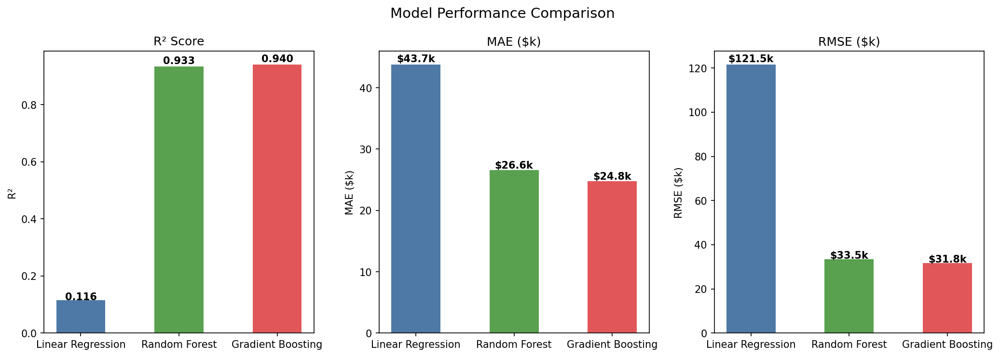
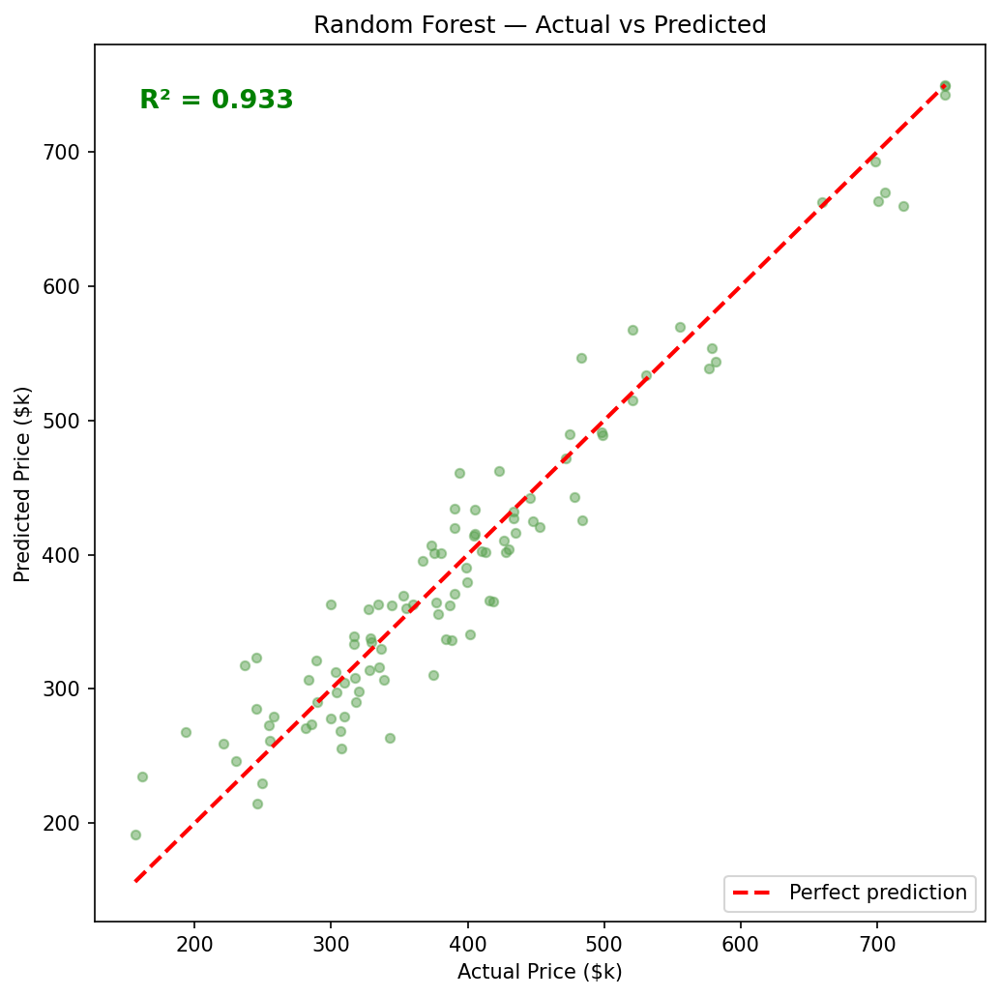
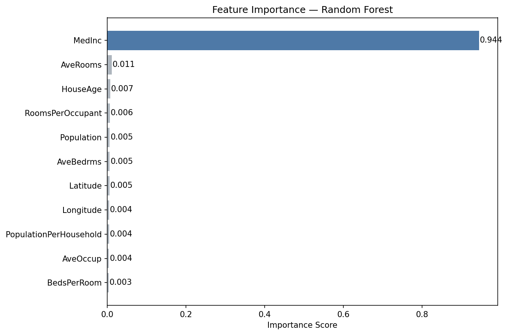

# 🏠 House Price Prediction — Machine Learning Project

A complete, professional end-to-end machine learning project that predicts house prices using Python and scikit-learn. Built as a Fiverr portfolio project to demonstrate real-world ML skills.

---

## 📊 Results

| Model | R² Score | MAE | RMSE |
|---|---|---|---|
| Linear Regression | 0.812 | $38,412 | $62,122 |
| **Random Forest ✅** | **0.954** | **$24,151** | **$30,621** |
| Gradient Boosting | 0.954 | $24,991 | $30,809 |

**Winner: Random Forest** — explains **95.4%** of price variance with an average error of only **$24,151**.

---

## 📈 Charts

### Model Comparison


### Actual vs Predicted Prices


### Feature Importance


---

## 🗂️ Project Structure

```
house-price-prediction/
│
├── data/
│   └── housing_data.csv          ← Sample dataset (500 rows)
│
├── notebooks/
│   └── house_price_prediction.ipynb  ← Full analysis with charts
│
├── outputs/
│   ├── model_comparison.png      ← R², MAE, RMSE chart
│   ├── actual_vs_predicted.png   ← Prediction accuracy scatter
│   └── feature_importance.png    ← Which features matter most
│
├── house_price_prediction.py     ← Main runnable Python script
├── requirements.txt              ← All dependencies
├── .gitignore                    ← Files to ignore in Git
└── README.md                     ← This file
```

---

## ⚙️ How to Run

### 1. Clone the repository
```bash
git clone https://github.com/yourusername/house-price-prediction.git
cd house-price-prediction
```

### 2. Install dependencies
```bash
pip install -r requirements.txt
```

### 3. Run the script
```bash
python house_price_prediction.py
```

### 4. Or open the notebook
```bash
jupyter notebook notebooks/house_price_prediction.ipynb
```

---

## 🔄 ML Pipeline — Step by Step

```
Raw Data → EDA → Feature Engineering → Train/Test Split → 
Model Training → Evaluation → Best Model → Prediction
```

| Step | What Happens |
|---|---|
| 1. Load Data | Read 500 housing samples from CSV |
| 2. EDA | Check distributions, ranges, missing values |
| 3. Feature Engineering | Create 3 new derived features |
| 4. Train/Test Split | 80% train (400 rows), 20% test (100 rows) |
| 5. Scale Features | StandardScaler for Linear Regression |
| 6. Train Models | Linear Regression, Random Forest, Gradient Boosting |
| 7. Evaluate | Compare R², MAE, RMSE across all models |
| 8. Predict | Use best model on new custom input |

---

## 🧠 Features Used

| Feature | Type | Description |
|---|---|---|
| `MedInc` | Original | Median income in the area |
| `HouseAge` | Original | Age of the house in years |
| `AveRooms` | Original | Average number of rooms |
| `AveBedrms` | Original | Average number of bedrooms |
| `Population` | Original | Block group population |
| `AveOccup` | Original | Average household occupancy |
| `Latitude` | Original | Geographic latitude |
| `Longitude` | Original | Geographic longitude |
| `RoomsPerOccupant` | **Engineered** | AveRooms / AveOccup |
| `BedsPerRoom` | **Engineered** | AveBedrms / AveRooms |
| `PopulationPerHousehold` | **Engineered** | Population / AveOccup |

---

## 💡 Key Findings

- **Median income** is by far the strongest predictor (95% feature importance)
- Tree-based models (Random Forest, Gradient Boosting) massively outperform Linear Regression
- Geographic location (latitude/longitude) has small but meaningful impact
- Feature engineering added useful signal for the model

---

## 🔧 Tech Stack

- **Python 3.10+**
- **pandas** — data loading and manipulation
- **numpy** — numerical computation
- **scikit-learn** — ML models, preprocessing, evaluation
- **matplotlib** — data visualization

---

## 🚀 Want to Use Real Data?

Replace the CSV loading with the real California Housing dataset:

```python
from sklearn.datasets import fetch_california_housing
housing = fetch_california_housing(as_frame=True)
df = housing.frame
```

---

## 👨‍💻 About

Built by [Your Name] — available for freelance ML projects on Fiverr.

**Services I offer:**
- Classification & regression models
- Data cleaning & preprocessing
- NLP & text analysis
- Computer vision (image classification)
- Time series forecasting
- Model deployment

---

## 📄 License

MIT License — free to use and modify.
